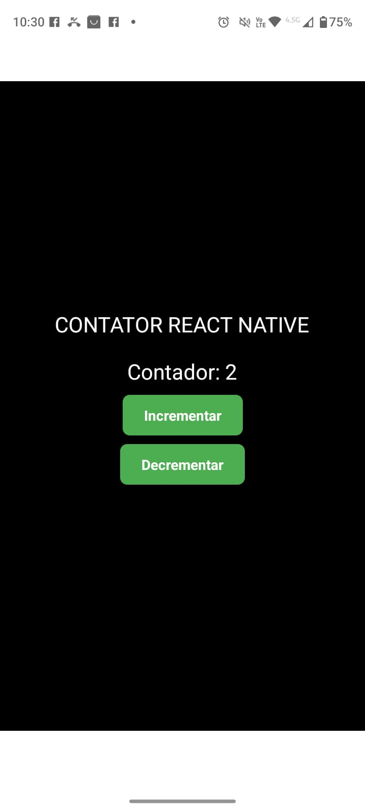
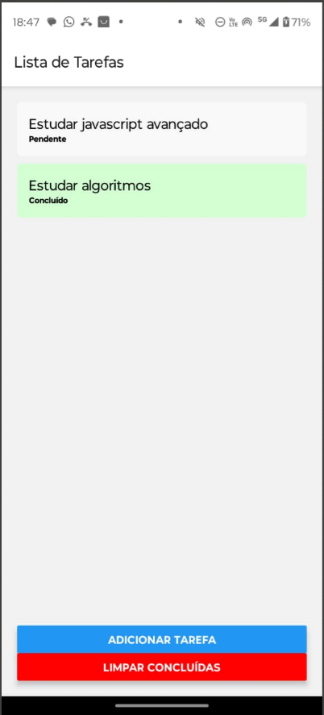
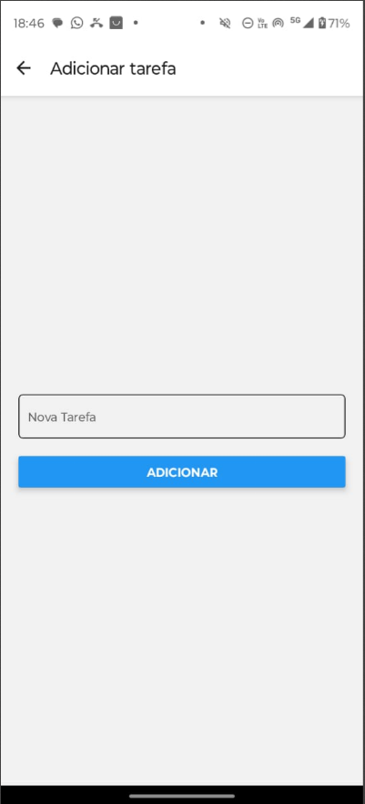

# 🚀 Everton Cruz - Portfólio de Projetos

Bem-vindo ao meu portfólio! Aqui você encontra alguns dos projetos que desenvolvi com foco em desenvolvimento mobile e web usando **React Native** até o momento, sempre buscando boas práticas e código limpo.

---

## 📱 Aplicativos Mobile

### 🧮 Contador React Native

- **Repositório:** [contador-react-native](https://github.com/evertoncruz/contador-react-native)
- **Tecnologias:** React Native, Expo
- **Descrição:** Um simples contador feito em React Native com incremento, decremento e reset. Ideal para treinar conceitos básicos de estado e interação.

---

### ✅ ToDo List React Native

- **Repositório:** [desafio-todo-list-v](https://github.com/evertoncruz/desafio-todo-list-v)
- **Tecnologias:** React Native, Expo
- **Descrição:** Uma lista de tarefas com adição, exclusão e marcação de concluído. Desenvolvido como desafio prático para reforçar manipulação de listas e componentes no React Native.

---

## 📫 Contato

- **LinkedIn:** [linkedin.com/in/evertoncruz](https://linkedin.com/in/evertoncruz)
- **Email:** cruz.everton@gmail.com

---

🔧 _Mais projetos em breve!_
