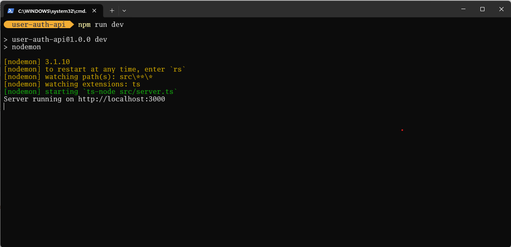
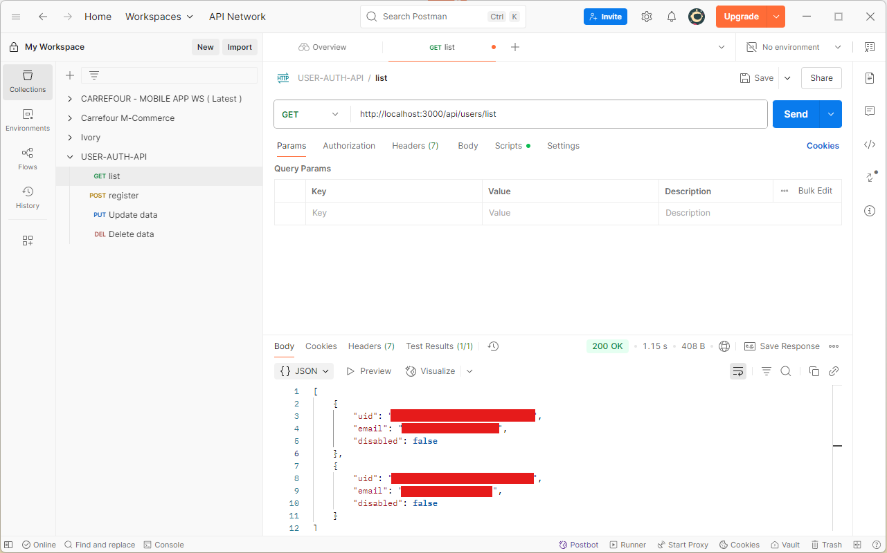
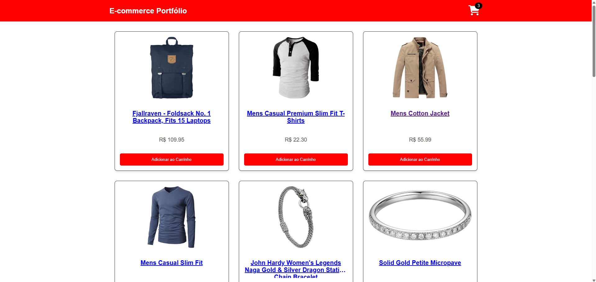
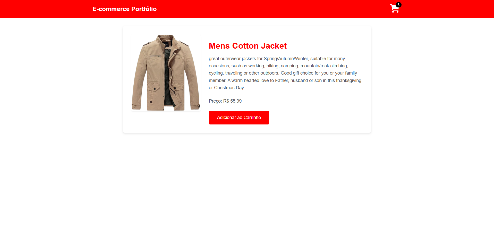
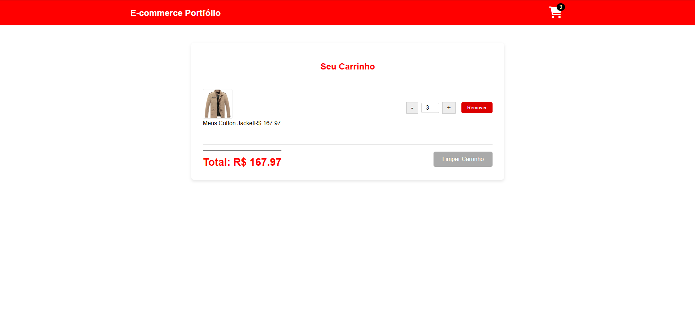
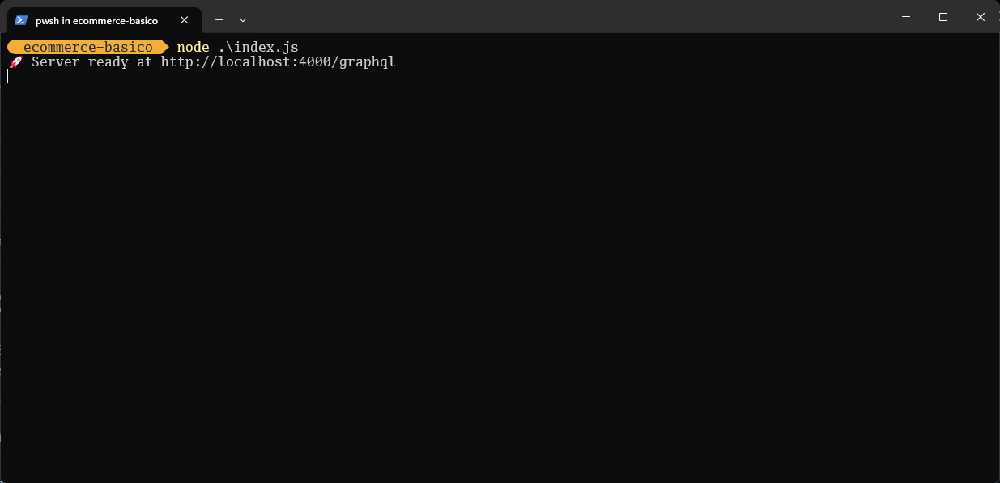

# 🚀 Everton Cruz - Portfólio de Projetos

Bem-vindo ao meu portfólio! Aqui você encontra alguns dos projetos que desenvolvi com foco em desenvolvimento mobile e web, sempre buscando boas práticas e código limpo.

Em constante evolução, para mais projetos acesse demais repositórios!

---

## 🔐 Aplicações Web

### 🌐 API de Autenticação Node.js

- **Repositório:** [user-auth-api](https://github.com/evertoncruz/user-auth-api)
- **Tecnologias:** Node.js, Express, TypeScript, Firebase, Jest
- **Descrição:** API RESTful de autenticação de usuários, com registro, listagem e login via Firebase. Inclui testes automatizados com Jest e Supertest. Ideal para treinar boas práticas com TypeScript, rotas seguras e integração com serviços externos.

---

### 🛒 E-commerce

#### 🛒 Aplicação E-commerce React

- **Repositório:** [e-commerce-basico](https://github.com/evertoncruz/ecommerce-basico)
- **Tecnologias:** React, TypeScript, GraphQL, Apollo Client, CSS, Node.js, Vercel
- **Descrição:** Uma aplicação de e-commerce responsiva, com listagem de produtos, página de detalhes e carrinho de compras. O frontend em React consome dados de uma API externa através de um backend-for-frontend (BFF) em GraphQL, seguindo o padrão REST. O projeto demonstra o uso de hooks, gerenciamento de estado e integração com APIs.

---

#### 🛍️ Backend-for-Frontend (BFF)

- **Repositório:** [e-commerce-basico-bff](https://github.com/evertoncruz/ecommerce-basico-bff)
- **Tecnologias:** Node.js, GraphQL, Express, Apollo Server, Railway
- **Descrição:** O backend-for-frontend (BFF) da aplicação de e-commerce, desenvolvido para atuar como uma camada de dados entre o frontend e APIs externas. Ele expõe um único endpoint GraphQL para o frontend, simplificando a obtenção de dados e otimizando a comunicação. Este projeto foi hospedado no Railway para garantir um ambiente de produção dedicado.

---

## 📱 Aplicativos Mobile

### 🧮 Contador React Native

- **Repositório:** [contador-react-native](https://github.com/evertoncruz/contador-react-native)
- **Tecnologias:** React Native, Expo
- **Descrição:** Um simples contador feito em React Native com incremento, decremento e reset. Ideal para treinar conceitos básicos de estado e interação.

---

### ✅ ToDo List React Native

- **Repositório:** [desafio-todo-list-v](https://github.com/evertoncruz/desafio-todo-list-v)
- **Tecnologias:** React Native, Expo
- **Descrição:** Uma lista de tarefas com adição, exclusão e marcação de concluído. Desenvolvido como desafio prático para reforçar manipulação de listas e componentes no React Native.

---

## 📫 Contato

- **LinkedIn:** [linkedin.com/in/evertoncruz](https://linkedin.com/in/evertoncruz)
- **Email:** cruz.everton@gmail.com

---

🔧 _Mais projetos em breve!_
